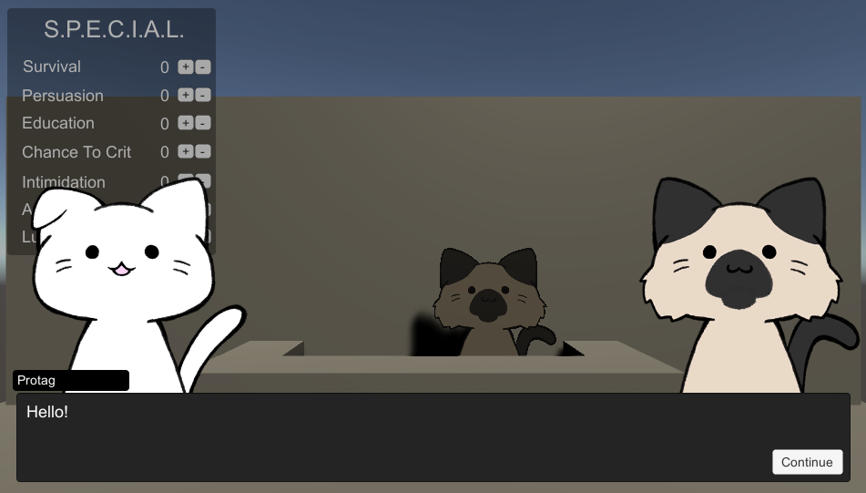
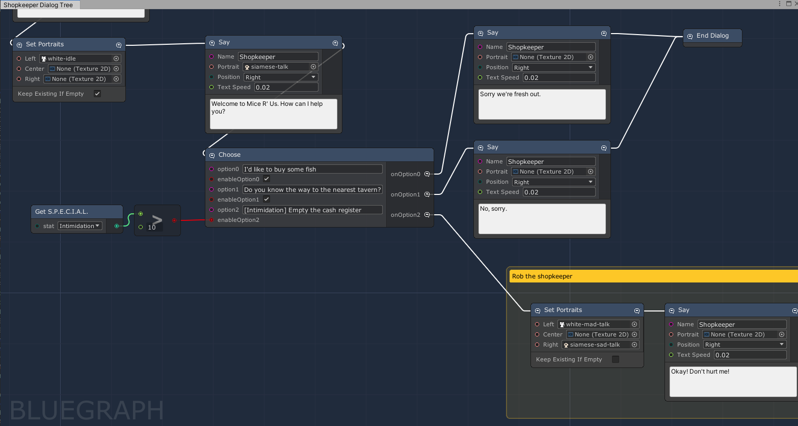
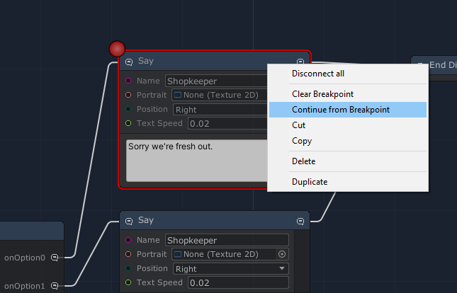
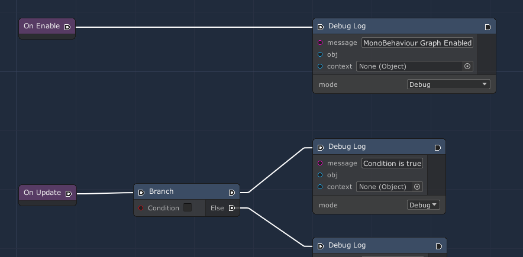
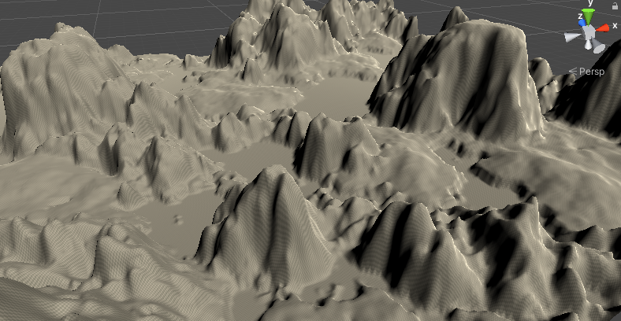
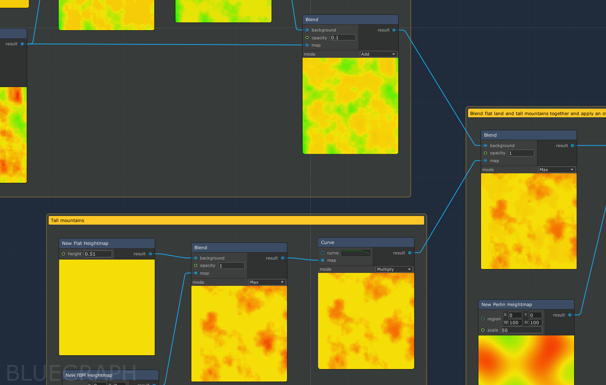
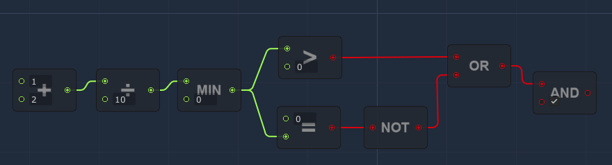
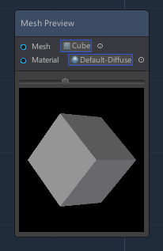
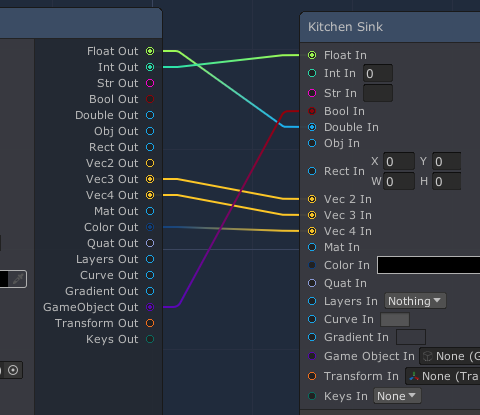

# BlueGraph Samples

Unity project containing various samples using the [BlueGraph Framework](https://github.com/McManning/BlueGraph).

The following samples are available for you to play around with or use as a base for your own projects:

# Dialog Tree

Visualize and modify a typical RPG-style dialog system. 




This includes nodes for setting portraits and letting the player choose different responses based on game conditions (their current stats, relationship to an NPC, etc).

Each NPC can be assigned a different Dialog graph asset to execute when the player interacts with them. 

## Running the Sample

Open the **Test Dialog Tree** scene and go into play mode. Click on the shopkeeper cat to start a conversation.

To show additional dialog choices, set your **Intimidation** stat to 10+.

## Modifiable in Play Mode

This graph can be modified in Play Mode, allowing you to quickly iterate on conversation flow while testing the game.

## Breakpoints

While in Play Mode, you can set breakpoints on the Graph to pause execution when the breakpoint is reached. Right click a node in the graph and click **Set Breakpoint**. Once that node has been reached in Play Mode, it will be highlighted and you have to click **Continue from Breakpoint** to move on.




# Execution Flow

Execute a series of nodes in the style of UE4 Blueprints in response to different events.



## Running the Sample

Open the **Test Execution Flow** scene and start Play Mode. You should see debug messages spamming the console. 

The *Graph Container* object in the scene has a *Use Mono Behaviour Graph* script that executes different nodes along an execution path (white edge) starting from different MonoBehaviour events.

## Executable Nodes

This sample contains nodes for branches (if/else) logic and loops to control which nodes are executed along the execution path. 

Any class extending `ExecutableNode` automatically has input and output execution flow ports and contains a method to run your business logic when that node is executed on the graph:

```cs
[Node]
[Tags("Executable")]
public class DoFoo : ExecutableNode 
{ 
    [Input] public string message;

    public override IExecutableNode Execute(ExecutionFlowData data)
    {
        string msg = GetInputValue("message", message);

        Debug.Log(msg);

        // ExecutableNode.Execute() will return the next node 
        // to be executed (what our flow output is connected to)
        return base.Execute(data);
    }
}
```

# Terrain Generator

Procedurally create a Unity Terrain by blending different heightmap generators




## Running the Sample

Open the **Test Terrain** scene and on the Terrain asset's *Procedural Terrain* script click the *Apply to Terrain* button in the inspector.

You can edit the graph to add new heightmap factory nodes (fBM noise, Perlin noise, etc) and blend different noises together using Animation Curves and other blend algorithms. 

To see your changes applied to the Unity Terrain in the scene, click the *Apply To Terrain* button again.

## Factory and Transform Nodes

There are two types of abstract nodes in this graph that all other nodes are built on top of:

* `HeightmapFactory` instantiates a new `Heightmap` instance
* `HeightmapTransform` takes one or more `Heightmap` inputs and outputs a new `Heightmap` with the transformation applied. 

For all nodes the output `Heightmap` is displayed within the node to help you visualize how each step of the graph changes the final results.

# Math Nodes

The **Common/Math** folder contains boolean logic and floating point math nodes that are used within all other samples.



# Misc

Other examples that have no other home. 

There is a node to demo mesh previews within an IMGUIContainer (see `MeshPreviewNodeView`) as well as "kitchen sink" nodes for demoing the different types of data supported. 




There is also a `DynamicVector` class that, when used as a port type, allows you to cast any vector/float dimension to another vector/float within the graph editor. This makes use of BlueGraph's `IConvertible` support for safe type conversions.
